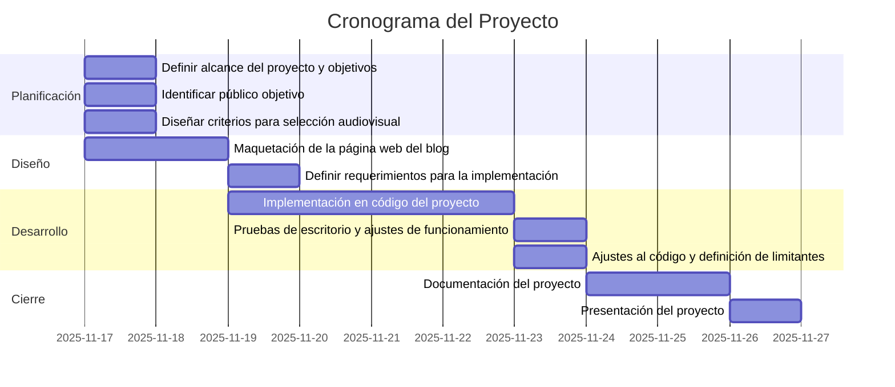

# Cine que educa

## Presentación

[Presentación canva](https://www.canva.com/design/DAG5GpB41dc/kZqKOBdpi-cjwqoQSypYng/view?utm_content=DAG5GpB41dc&utm_campaign=designshare&utm_medium=link2&utm_source=uniquelinks&utlId=h00e72ed5fc)

## Introducción

“Cine que Educa” es un espacio digital (blog o plataforma web) que recopila, analiza y recomienda películas, cortometrajes, documentales y videos que transmiten mensajes educativos positivos, fomentan valores y apoyan el desarrollo de una educación crítica y de calidad.
Incluye reseñas, guías pedagógicas y actividades para que docentes, estudiantes y familias puedan usar estos materiales como herramientas de aprendizaje.

### Objetivos

#### Objetivo General

Promover el uso de recursos audiovisuales como apoyo pedagógico para fortalecer competencias, valores y pensamiento crítico en estudiantes, contribuyendo a una educación más humana, creativa y de calidad.

#### Objetivos Específicos
- Seleccionar películas y videos con contenido educativo valioso.
- Elaborar reseñas accesibles y atractivas para docentes y estudiantes.
- Crear actividades y preguntas de reflexión para aplicar en el aula.
- Fomentar el uso de medios audiovisuales como herramientas de aprendizaje activo.
- Construir una comunidad educativa que comparta recomendaciones y experiencias.

##  Público Objetivo
- Docentes de todos los niveles.  
- Estudiantes desde primaria hasta bachillerato.  
- Padres y madres interesados en contenidos educativos.  
- Instituciones educativas que busquen recursos innovadores.  

## Contenidos del Blog

### **A. Sección de Reseñas**
- Clasificación por edades  
- Mensajes principales  
- Valores a trabajar  
- Contenidos curriculares asociados  

### **B. Videos Educativos Cortos**
- Ciencia  
- Cultura  
- Convivencia  
- Educación ambiental  
- Educación emocional  

### **C. Recomendaciones por Temas**
- Resolución de conflictos  
- Medio ambiente  
- Historia y ciudadanía  
- Tecnología y ciencia  

## Ejemplos de Películas a Incluir
- **El niño que domó el viento** – perseverancia y creatividad  
- **En busca de la felicidad** – resiliencia  
- **Coco** – identidad cultural  
- **Wonder** – empatía e inclusión  
- **El camino a la escuela** – valor de la educación  
- Documentales educativos de **BBC**, **National Geographic**, etc.  

## Actividades Complementarias
- Club de cine educativo mensual  
- Foros virtuales de discusión  
- Descarga de fichas pedagógicas    

## Recursos Necesarios
- Computador con software de desarrollo 
- Diseño gráfico básico  
- Redes sociales para difusión  

## Impacto Esperado
- Aumento del uso de material audiovisual en el aula.  
- Mejora en la motivación y participación de estudiantes.  
- Desarrollo de habilidades socioemocionales.  
- Construcción de una cultura escolar más reflexiva, crítica y colaborativa.  

## Estructura inicial del Blog
- **Inicio:** novedades y recomendaciones  
- **Películas:** reseñas y guías  
- **Videos cortos:** contenido educativo y dinámico  
- **Recursos para docentes**  
- **Actividades y proyectos**  
- **Contacto / Comunidad**  

## Definición de Presupuesto

### **1. Tipos de Costos**

#### **1.1. Costos Fijos**

- Dominio web anual  
- Hosting mensual o anual  
- Licencias o herramientas digitales  
- Sueldos fijos del equipo  

#### **1.2. Costos Variables**
- Horas de diseño o programación  
- Revisión y mantenimiento adicional  
- Producción de contenido  
- Publicidad pagada  

### **2. Control Financiero**

- Asignación de recursos  
- Registro de gastos  
- Seguimiento plan vs real  
- Ajustes necesarios  

### **3. Herramientas Simples para Manejo de Presupuestos**

#### **3.1. Hojas de Cálculo**

- Sumar costos automáticamente  
- Crear tablas  
- Generar gráficos  
- Control mensual  
- Uso de plantillas  
- Presupuesto mensual  
- Presupuesto de proyectos  
- Control de gastos  
- Cronograma con costos  

## Presupuesto Básico: Desarrollo de Página Web

### **A. Costos Fijos**
| Concepto | Monto aproximado |
|----------|------------------|
| Dominio web (.com) (anual) | $12 – $15 USD |
| Hosting (básico) | $50 – $80 USD anuales |
| Certificado SSL | $0 – $20 USD |
| Plantilla premium (opcional) | $20 – $60 USD |

**Subtotal:** **$82 – $175 USD**

### **B. Costos Variables**
| Concepto | Monto | Descripción |
|----------|-------|-------------|
| Diseño web | $150 – $300 USD | Estructura, estilo, identidad visual |
| Programación/Desarrollo | $200 – $600 USD | Funcionalidades, compatibilidad, optimización |
| Creación de contenido | $50 – $150 USD | Textos, imágenes, SEO básico |
| Revisiones y ajustes | $30 – $80 USD | Correcciones finales |
| Mantenimiento mensual (opcional) | $15 – $40 USD | Actualizaciones y soporte |

**Subtotal:** **$430 – $1,130 USD**  

---

### **C. Total Estimado**
#### **Costo total inicial:** **$512 – $1,305 USD**

## Cronograma de desarrollo del proyecto

## Uso de herramientas y tecnologias
Para el desarrollo de este proyecto de software se utilizaron las siguientes herramienta y tecnologias de software:

### Herramientas de software

- Visual studio code
- Chat gpt
- Navegadores (chrome)
- Git
- Github

### Tecnologias de software

- Python
- Html
- CSS
- Java Script
- Json
- Pandas
- API (Flask, Youtube y TMDB)

## Estructura del proyecto

Se desarrolló un sitio web compuesto por una página principal con una estructura para almacenar un listado de películas con sus respectivas reseñas, y una página secundaria destinada a la búsqueda de películas, videos y documentales, así como a la creación de nuevas reseñas.

El sitio fue construido en HTML, con estilos en CSS, y funcionalidades interactivas implementadas en JavaScript.

La aplicación se conecta a un servidor desarrollado en Python, utilizando Flask como API y Pandas para el manejo de datos. Este servidor integra las APIs de TMDB y YouTube para obtener películas, videos y contenido educativo junto con sus descripciones. A cada elemento se le puede agregar una reseña, la cual es almacenada en una base de datos en formato JSON.

## Como ejecutar el proyecto

La maqueta se ejecuta desde una carpeta que contiene los archivos HTML, CSS, JavaScript, JSON y Python desarrollados, además de una carpeta de recursos donde se almacenan las imágenes. Para su funcionamiento, es necesario iniciar primero el servidor en Python, y posteriormente ejecutar la página principal “index.html” desde el navegador.

